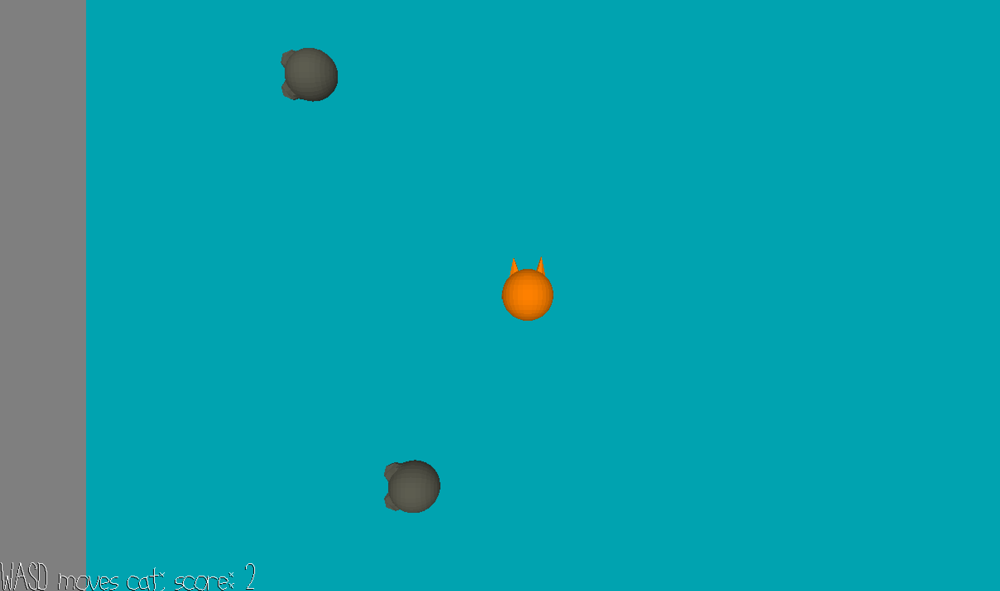

# Mouse Catch

Author: Sarah Pethani

Design: A whack-a-mole-esque game in which you are a cat trying to defeat all the mice that randomly spawn! Game ends when mice take over.

Screen Shot:

How To Play:

Use WASD to control your cat player. To defeat mice, bump into them with your cat. The mice will randomly spawn around the map at random times. If all 8 mice have respawned on the map, the game ends. Your score increases with each defeated mouse!

This game was built with [NEST](NEST.md).
